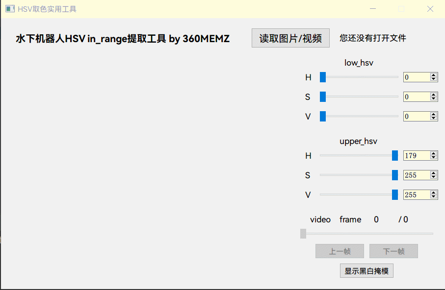
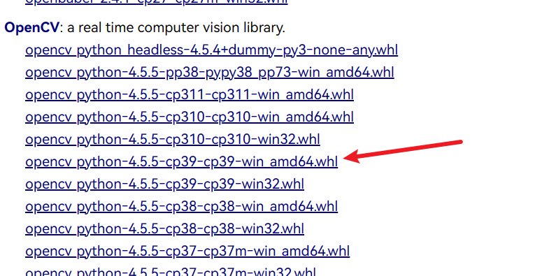

# HSV色域图像分割工具

本工具基于PyQt5和openCV设计了一个简单的用于模拟openCV中`in_range`函数不同参数的分隔效果, 也是我为了节省水下机器人视觉巡线参数探索设计的工具.



## 特点

- 实时调节,所见即所得,快速高效
- 支持图片和视频
- 彩色模式和黑白模式, 确认分割效果
- 视频的逐帧调节

## 运行

为了运行本程序, 请选择适当的python版本(我这里是python 3.9,推荐用anaconda), 使用pip 安装**(不要用conda install,否则会互相冲突!!)**

```shell
pip install pyqt5-tools
```

随后安装opencv_python. 建议手动下载**对应python版本**的whl文件,使用pip安装.



参考网址 : [Archived: Python Extension Packages for Windows - Christoph Gohlke (uci.edu)](https://www.lfd.uci.edu/~gohlke/pythonlibs/)

## 已知Bug

Bug 1: 不支持中文路径. 您可以拷贝到根目录或者电脑的图片等文件夹打开.

Bug 2: 目前已知从树莓派意外关机采集的视频(即没有调用`cap.release()`)会不能统计帧数, 此类视频在视频播放器表现为播放速率不正常且不能统计视频时长. 您可以手动使用FFmpeg等工具进行视频格式转换.

## License

本代码用到的PyQt5遵循GPL V3协议, openCV遵循Apache 2.0协议. 